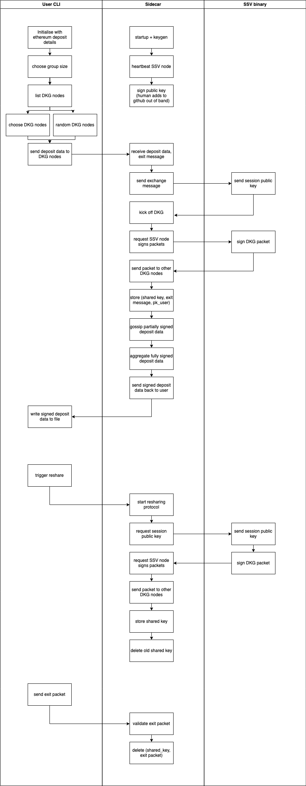

# High level architecture

After several rounds of discussion with the SSV team, we have aligned on building a user CLI, an operator sidecar, and a repository for hosting operator keys (currently hosted in this repo in the [nodes folder](../nodes)).

A rough sequence diagram for the flow of creating a distributed validator can be seen below:

